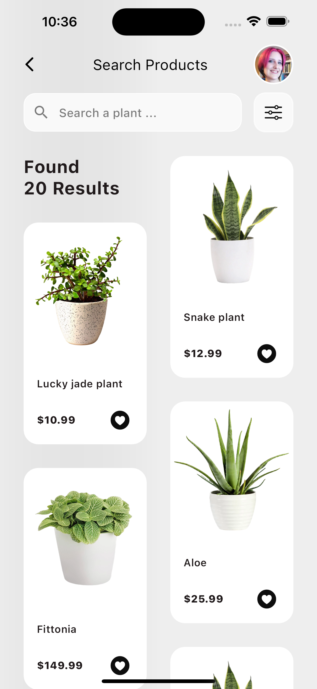

# Flutter Coding Challenge: Plants UI App

link: https://www.youtube.com/live/aERczKh_uMk?si=e_eKUaUP4Ihaj7r_&t=360

 | Init | Products | Product |
 |------|----------|---------|
 || | |

 

# Features
* BLoC
* Linter
* Animation:
  * Init page - Circle button
  * Products page - Like button
  * Products page - grid bottom appearance animation
  * Products page - custom avatar animation
  * Products page - product card onTap inkWell animation

